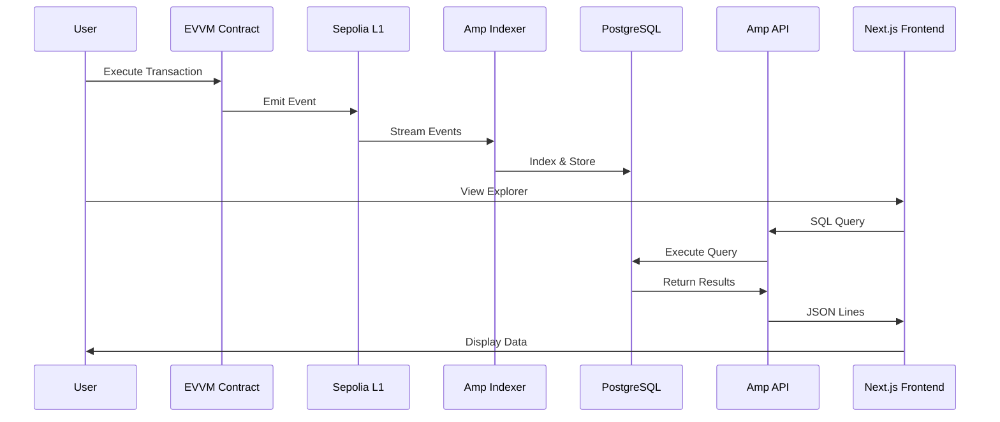
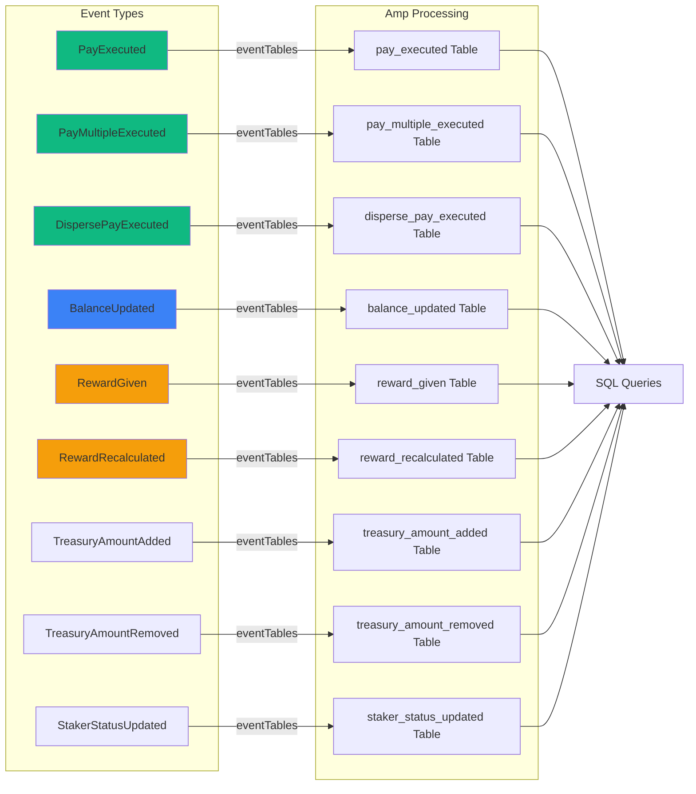

# EVVM Block Explorer

A block explorer for EVVM (MATE Metaprotocol) built with Next.js and The Graph's Amp.

## 🎯 Description

This block explorer allows you to visualize and explore EVVM activity, a virtual blockchain that exists as smart contracts on Sepolia. It uses **The Graph's Amp** to index events from a custom EVVM contract with events.

**✨ Key Features:**
- Automatic event indexing using Amp's `eventTables()`
- Visualization of transactions, balances, and rewards
- Tracking of multiple event types (payments, rewards, balance changes, etc.)

## 🏗️ Architecture

### System Architecture

```mermaid
graph TB
    subgraph "L1 Blockchain - Sepolia"
        SC[EVVM Smart Contract]
        SC -->|Emits Events| Events[Contract Events]
    end
    
    subgraph "Indexing Layer"
        Events -->|Stream| Amp[Amp Indexer]
        Amp -->|SQL Queries| DB[(PostgreSQL)]
        Amp -->|HTTP API| API[Amp HTTP Endpoint]
    end
    
    subgraph "Frontend - Next.js"
        API -->|SQL Queries| NextJS[Next.js App]
        NextJS -->|Render| UI[User Interface]
    end
    
    style SC fill:#4A90E2
    style Amp fill:#6B46C1
    style NextJS fill:#000000
    style DB fill:#336791
```



### Data Flow



### Event Indexing Flow



### Component Architecture

```mermaid
graph TB
    subgraph "Next.js App Router"
        Home[Home Page<br/>page.tsx]
        Block[Block Detail<br/>block/[id]/page.tsx]
        Tx[Transaction Detail<br/>tx/[id]/page.tsx]
        Address[Address Detail<br/>address/[id]/page.tsx]
    end
    
    subgraph "API Layer"
        AmpAPI[lib/api/amp.ts]
        AmpAPI -->|queryAmpSQL| Functions[Query Functions]
    end
    
    subgraph "Data Layer"
        Functions -->|SQL| Amp[Amp HTTP Endpoint]
        Amp -->|JSON Lines| Parse[Data Parsing]
    end
    
    subgraph "UI Components"
        Home --> Components[React Components]
        Block --> Components
        Tx --> Components
        Address --> Components
        Components --> UI[shadcn/ui]
    end
    
    Parse --> Components
    
    style Home fill:#0070F3
    style Block fill:#0070F3
    style Tx fill:#0070F3
    style Address fill:#0070F3
    style AmpAPI fill:#6B46C1
```

## 🚀 Features

- **Home Page**: Displays the latest EVVM blocks and transactions, along with general statistics
- **Block Detail**: Visualizes complete information for each virtual EVVM block and its transactions
- **Transaction Detail**: Shows all details of an EVVM transaction, including links to the L1 transaction
- **Address Detail**: Transaction history for EVVM addresses
- **Indexed Events**: 
  - `PayExecuted` - Individual payments
  - `PayMultipleExecuted` - Multiple payments
  - `DispersePayExecuted` - Payment distribution
  - `BalanceUpdated` - Balance changes
  - `RewardGiven` - Rewards granted
  - `RewardRecalculated` - Reward recalculation
  - `TreasuryAmountAdded/Removed` - Treasury operations
  - `StakerStatusUpdated` - Staker status changes

## 📋 Prerequisites

- Node.js 22+ and pnpm 10+ (this project uses pnpm like the [official Amp demo](https://github.com/edgeandnode/amp-demo))
- [Amp](https://github.com/edgeandnode/amp) installed and running
- PostgreSQL (for Amp metadata database)
- Foundry (for compiling and deploying contracts)

## 🛠️ Quick Setup

### 1. Install Dependencies

```bash
# Install pnpm if you don't have it
npm install -g pnpm

# Install project dependencies
pnpm install

# Install Foundry dependencies
pnpm run forge:install-deps
```

### 2. Configure and Run Amp

**🚀 Quick Start**: See [docs/QUICK_START.md](./docs/QUICK_START.md) for a simplified step-by-step guide.

**📖 Complete Guide**: See [docs/SETUP.md](./docs/SETUP.md) for detailed instructions.

**Quick summary:**

1. **Install PostgreSQL**:
   ```bash
   brew install postgresql@16
   brew services start postgresql@16
   ```

2. **Install Amp**:
   ```bash
   curl -fsSL https://ampup.sh/install.sh | sh
   ```

3. **Configure Amp**: Configuration is in `infra/amp/config.toml` and `infra/amp/providers/sepolia.toml`

4. **Start Amp**:
   ```bash
   pnpm run amp:server
   # Or: ampd --config infra/amp/config.toml dev
   ```

5. **Build and deploy datasets**:
   ```bash
   pnpm run amp:setup
   ```

6. **Start the frontend**:
   ```bash
   pnpm run dev
   ```

For more details, see [docs/SETUP.md](./docs/SETUP.md).

### 3. Deploy EVVM Contract with Events

The project includes a custom `EvvmWithEvents.sol` contract with events for better Amp integration.

**Deploy the contract:**

```bash
# 1. Configure environment variables in .env
PRIVATE_KEY=your_private_key_without_0x
SEPOLIA_RPC_URL=https://rpc.sepolia.org
ETHERSCAN_API_KEY=your_optional_key

# 2. Compile contracts
pnpm run forge:build

# 3. Deploy
export PRIVATE_KEY=$(grep "^PRIVATE_KEY=" .env | cut -d= -f2)
export SEPOLIA_RPC_URL=$(grep "^SEPOLIA_RPC_URL=" .env | cut -d= -f2 | xargs)
export ETHERSCAN_API_KEY=""
pnpm run forge:deploy
```

**After deployment:**

1. Save the deployed contract address
2. Copy the ABI: `cp out/EvvmWithEvents.sol/EvvmWithEvents.json abis/EvvmWithEvents.json`
3. Update `amp.config.ts` with the new address (already configured to use `eventTables()`)
4. Rebuild the dataset: `pnpm run amp:build && pnpm run amp:register && pnpm run amp:deploy`

See [docs/DEPLOY_EVVM_WITH_EVENTS.md](./docs/DEPLOY_EVVM_WITH_EVENTS.md) for more details.

### 4. Generate Test Transactions

To generate events and test the system:

```bash
# Use the Foundry script to generate transactions
pnpm run forge:test-transactions
```

Or manually using `addBalance` (faucet function):

```bash
# Add balance to an account (emits BalanceUpdated)
cast send 0x4Db514984aAE6A24A05f07c30310050c245b0256 \
  "addBalance(address,address,uint256)" \
  0xYOUR_ADDRESS \
  0x0000000000000000000000000000000000000000 \
  1000000000000000000 \
  --rpc-url $SEPOLIA_RPC_URL \
  --private-key $PRIVATE_KEY
```

See [docs/GENERATE_TEST_TRANSACTIONS.md](./docs/GENERATE_TEST_TRANSACTIONS.md) for more options.

### 5. Configure Environment Variables

Create a `.env.local` file in the project root:

```env
# Amp HTTP endpoint (default: http://localhost:1603)
NEXT_PUBLIC_AMP_ENDPOINT=http://localhost:1603

# Namespace where your EVVM tables are (adjust according to your configuration)
NEXT_PUBLIC_AMP_NAMESPACE=evvm

# Sepolia RPC (optional, for direct queries as fallback)
NEXT_PUBLIC_SEPOLIA_RPC_URL=https://sepolia.infura.io/v3/YOUR_KEY
```

### 6. Run in Development

```bash
pnpm run dev
```

Open [http://localhost:3000](http://localhost:3000) in your browser.

## 📊 Deployed Contract

**EVVM Contract with Events on Sepolia:**
- Address: `0x4Db514984aAE6A24A05f07c30310050c245b0256`
- EVVM ID: `1000`
- View on Etherscan: [Sepolia Explorer](https://sepolia.etherscan.io/address/0x4Db514984aAE6A24A05f07c30310050c245b0256)

## 📋 Implementation Plan

To implement the complete block scanner that tracks multiple EVVM contracts:

- **Executive Summary**: [docs/IMPLEMENTATION_SUMMARY.md](./docs/IMPLEMENTATION_SUMMARY.md)
- **Complete Plan**: [docs/IMPLEMENTATION_PLAN.md](./docs/IMPLEMENTATION_PLAN.md)

The plan includes:
- Data architecture with Amp
- Table structure for multiple EVVMs
- Transaction and virtual block tracking
- Function decoding
- Complete block scanner frontend

## 📁 Project Structure

```
EVVM-Blockexplorer/
├── app/                    # Next.js pages
│   ├── page.tsx           # Home page
│   ├── block/[id]/        # Block detail
│   ├── tx/[id]/           # Transaction detail
│   └── address/[id]/      # Address detail
├── components/            # React components
├── contracts/             # Solidity contracts
│   ├── EvvmWithEvents.sol # EVVM contract with events
│   └── RegistryEvvmWithEvents.sol
├── scripts/              # Foundry scripts
│   ├── DeployEvvmWithEvents.s.sol
│   └── GenerateTestTransactions.s.sol
├── abis/                 # Contract ABIs
├── lib/
│   ├── api/
│   │   └── amp.ts         # Functions to query Amp
│   ├── types/
│   │   └── evvm.ts        # TypeScript types for EVVM data
│   ├── utils/
│   │   └── format.ts      # Formatting functions
│   └── config.ts          # Project configuration
├── infra/amp/            # Amp configuration
│   ├── config.toml
│   └── providers/
└── public/                # Static files
```

## 🔧 Usage

### Query Amp Data

The project includes predefined functions to query Amp data using SQL:

```typescript
import { queryAmpSQL } from "@/lib/api/amp"

// Get latest payments
const payments = await queryAmpSQL(`
  SELECT * FROM "evvm/evvm_explorer@dev".pay_executed 
  ORDER BY block_num DESC LIMIT 10
`)

// Get balance changes
const balances = await queryAmpSQL(`
  SELECT * FROM "evvm/evvm_explorer@dev".balance_updated 
  WHERE account = '0x...' 
  ORDER BY block_num DESC
`)
```

### Customize SQL Queries

You can modify SQL queries in `lib/api/amp.ts` to adjust them to your schema. Amp accepts standard SQL:

```typescript
// Direct query example
const sql = `SELECT * FROM "evvm/evvm_explorer@dev".pay_executed ORDER BY block_num DESC LIMIT 10`
const response = await fetch('http://localhost:1603', {
  method: 'POST',
  body: sql
})
```

Amp returns results in JSON Lines format (one JSON line per row).

## 🎨 Customization

- **Styles**: Modify `app/globals.css` to change global styles
- **UI Components**: Components are in `components/ui/` using shadcn/ui
- **Theme**: The project uses `next-themes` for light/dark theme support

## 🚢 Deployment

### Vercel (Recommended)

1. Connect your repository to Vercel
2. Configure environment variables in the Vercel dashboard
3. Deploy

### Other Providers

The project is compatible with any platform that supports Next.js:
- Netlify
- Railway
- AWS Amplify
- etc.

## 📝 Important Notes

- **Contract Events**: The `EvvmWithEvents` contract emits events that Amp automatically indexes using `eventTables()`
- **Performance**: SQL queries to Amp are fast, but consider implementing cache if you have high traffic
- **Namespaces**: Amp organizes data in namespaces. Adjust `NEXT_PUBLIC_AMP_NAMESPACE` according to how you configured your dataset
- **Response Format**: Amp returns data in JSON Lines format (one JSON line per row), which the code automatically parses
- **Empty Data**: If tables are empty, it's because there are no transactions emitting events yet. Generate test transactions to see data

## 🤝 Contributing

Contributions are welcome. Please:

1. Fork the project
2. Create a branch for your feature (`git checkout -b feature/AmazingFeature`)
3. Commit your changes (`git commit -m 'Add some AmazingFeature'`)
4. Push to the branch (`git push origin feature/AmazingFeature`)
5. Open a Pull Request

## 📄 License

This project is licensed under the MIT License.

## 🔗 Useful Links

- [Amp GitHub Repository](https://github.com/edgeandnode/amp) - Official Amp repository
- [Amp Documentation](https://ampup.sh/docs) - Documentation and examples
- [Next.js Documentation](https://nextjs.org/docs)
- [EVVM Contract on Sepolia](https://sepolia.etherscan.io/address/0x4Db514984aAE6A24A05f07c30310050c245b0256)
- [Foundry Documentation](https://book.getfoundry.sh/)

## 🎯 Hackathon Track

This project aligns with The Graph Hackathon's **🔊 Best Use of Amp Datasets** track, as it fully utilizes Amp to index EVVM contract events and query them via SQL, building a complete block explorer.

## 🧪 Generate Test Transactions

To test the system and generate events:

1. **Use `addBalance`** (simplest, no signature required):
   ```bash
   cast send 0x4Db514984aAE6A24A05f07c30310050c245b0256 \
     "addBalance(address,address,uint256)" \
     0xYOUR_ADDRESS \
     0x0000000000000000000000000000000000000000 \
     1000000000000000000 \
     --rpc-url $SEPOLIA_RPC_URL \
     --private-key $PRIVATE_KEY
   ```

2. **Use Foundry script** (requires signatures):
   ```bash
   pnpm run forge:test-transactions
   ```

3. **Deploy a helper contract** that uses `caPay` (contract-to-address payment)

See [docs/GENERATE_TEST_TRANSACTIONS.md](./docs/GENERATE_TEST_TRANSACTIONS.md) for more details.
